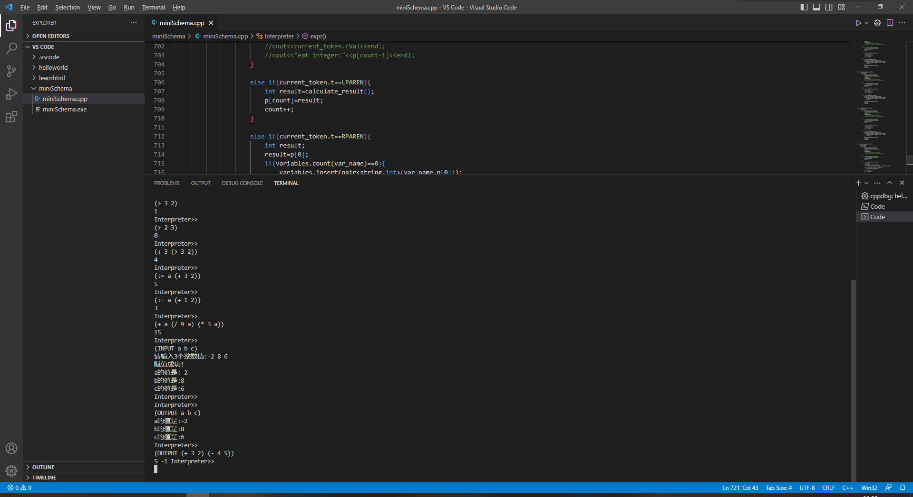

# 编译原理第一次作业：miniSchema语言解释器

miniSchema语言基本规范：

1. 标识符不区分大小写。标识符的构成同C语言。变量名是一种标识符

2. 整数常数如：125  

3) 串常量：用于提示串。格式："多个字符"

4. 语句格式：

   1. 一条语句即一个list即列表

   2. list即列表的格式如下：
      (op   list1或常数或变量    list2或常数或变量  ....)
      其中：op是运算符，list1、list2是列表。list中各个部分用一个或多个空格相分隔。
      上述列表的含义：执行op指定的运算（运算的各个对象由list1,list2...指明），并将结果在屏幕上显示出来。
      如(->是命令提示符)：->(+ (* 3  2) (- 5  2)  （/ 4 2）)
      输出:11

   3. 支持的运算符如下：
          3.1 算术运算符：+、-、、/
          3.2 关系运算符：> >=   <  <=   !=  =  
          如：->(>  3 2)  
                 输出:1 (1--代表true)
                  ->(>  2  3）
                 输出:0（0--false）
                  ->(+ 3 (> 3  2) )
                 输出:4
          3.3 赋值运算符：:=  
                  -> (:=  a  (+ 3  2)))
                 输出:5
           语义：首先执行(+ 3 2)，然后在变量表中查找变量a,若找到，将其当前值改为5,若找不到，则表中增加一项，即变量a，其值是5.
             示例：
               ->（:=  a  (+ 1  2)）
                    3
               ->(+  a  (/  9  a) (  3  a ))
                  15
         3.4 输入运算符:INPUT
         (input  "提示串"   变量1   变量2  ...)
         含义：命令单词input不区分大小写）
              屏幕上首先显示：提示串，然后将用户的输入的整数值(空格分隔)分别放到对应的各个变量中。
         示例：
         ->(INPUT "请输入三个整数值："   a   b   c )
         屏幕上提示：请输入三个整数值：-2  8  6   注：-2  8   6是用户从键盘上输入的
           此时 ：-2放到变量a中，8放到变量b中，6放到变量c中。
         3.5 输出运算符：OUTPUT
          ->（OUTPUT a  b   c）
           含义：将变量a  b  c的当前值输出。
         如：
         ->(INPUT "请输入三个整数值："   a   b   c )
         ->(OUTPUT a  b  c)
            a:-2   b:8   c:6
         ->(OUTPUT  (+ 3 2 )  (- 4 5))
            5  -1

# 运行结果

完美实现了作业要求中的所有指令，嵌套计算，INPUT，OUTPUT，赋值，自动识别变量数量等等功能均可实现。

且代码面向对象设计，可方便增加支持运算符及相应计算。

可运行代码自由测试。



# 代码部分

### 代码总体思路

用lexer类进行词法分析，将单词属性保存在token类当中，Interpreter类进行最终计算。

Interpreter类中主要包括了calculate_result() 和expr() 两个函数，前者用来进入计算状态，后者进行实际运算符识别与值计算，通过递归调用实现嵌套。

enum typer中存放支持的运算符，可自由增减。

### 完整代码

```c++
#include <iostream>
#include <ctype.h>
#include <utility>
#include <string>
#include <cstring>
#include <map>
using namespace std;

map<string, int> variables;
enum typer {
	INTEGER, PLUS, MINUS, MUL, DIV, LPAREN, RPAREN, INPUT, OUTPUT, VAR, NONE, GREATER, GREATEREQUAL, LESS, LESSEQUAL, NOTEQUAL, EQUAL, ASSIGN
};
//>GREATER >=GREATEREQUAL <LESS <=LESSEQUAL !=NOTEQUAL =EQUAL :=ASSIGN

//保存每个单词的属性
template <typename T, typename C>
class token {
public:
	typer t;
	int bitFlag;
	T value;
	C cVal;
	token() = default;
	token(typer type, int flag, T v, C c) : t(type), bitFlag(flag), value(v), cVal(c){     

    }
};
template <typename T>
auto getToken(T a,int flag) {
    return make_pair(a, flag);  //
}


//词法分析
class lexer {
public:
	int pos;
	char current_char;
	const char* text;
	//lexer() = default;
	lexer(const char* str) : text(str), pos(0) {
		current_char = str[pos];
		//cout << current_char << endl;
	}
	void Terror() {
		throw "lexer error";
	}

	void advance() {
		pos = pos + 1;
		int len = strlen(text);
		if (pos >= len) {
			current_char = '\0';
		}
		else {
			current_char = text[pos];
		}
	}

	void skip_whitespace() {
		while (isspace(current_char)) advance();
	}

	int integer() {
		int value = 0;
		while (current_char != '\0' && isdigit(current_char)) {
			value = value * 10 + (current_char - '0');
			advance();
		}
		return value;
	}

    string str(){
        string op;
        while(current_char!='\0' && (isalnum(current_char)||current_char=='>'||current_char=='<'||current_char=='='||current_char=='!'||current_char==':')){
            op=op+current_char;
            advance();
        }
        return op;
    }

	token<int,string> next_token() {
		while (current_char != '\0') {
			if (isspace(current_char)) {
				skip_whitespace();
				continue;
			}
			else if (isdigit(current_char)) {
				int val = integer();
				return token<int,string>(INTEGER, 1, val, "1");
			}
            else if (isalnum(current_char)||current_char=='>'||current_char=='<'||current_char=='='||current_char=='!'||current_char==':'){
                string op=str();
                if (op=="INPUT"){
                    return token<int,string>(INPUT,0,1,"INPUT");
                }
                else if (op=="OUTPUT"){
                    return token<int,string>(OUTPUT,0,1,"OUTPUT");
                }
				else if(op==">"){
					return token<int,string>(GREATER,0,1,">");
				}
				else if(op==">="){
					return token<int,string>(GREATEREQUAL,0,1,">=");
				}
				else if(op=="<"){
					return token<int,string>(LESS,0,1,"<");
				}
				else if(op=="<="){
					return token<int,string>(LESSEQUAL,0,1,"<=");
				}
				else if(op=="!="){
					return token<int,string>(NOTEQUAL,0,1,"!=");
				}
				else if(op=="="){
					return token<int,string>(EQUAL,0,1,"=");
				}
				else if(op==":="){
					return token<int,string>(ASSIGN,0,1,":=");
				}
                else{
                    return token<int,string>(VAR,0,1,op);
                }
            }
			else if (current_char == '+') {
				advance();
				return token<int, string>(PLUS, 0, 1, "+");
			}
			else if (current_char == '-') {
				advance();
				return token<int, string>(MINUS, 0, 1, "-");
			} 
			else if (current_char == '*') {
				advance();
				return  token<int, string>(MUL, 0, 1, "*");
			}
			else if (current_char == '/') {
				advance();
				return  token<int, string>(DIV, 0, 1, "/");
			}
			else if (current_char == '(') {
				advance();
				return  token<int, string>(LPAREN, 0, 1, "(");
			}
			else if (current_char == ')') {
				advance();
				return token<int, string>(RPAREN, 0, 1, ")");
			}
			else {
				Terror();
			}
			//return  token<int, char>(NONE, 0, 1, '#');
		}
		return  token<int, string>(NONE, 0, 1, "None");
	}

    
};


class Interpreter {
public:
    lexer lex;
    token<int, string> current_token;
    Interpreter(lexer str) : lex(str) {
        current_token = lex.next_token();
	}

    void eat(typer type) {
		if (current_token.t == type) {
			current_token = lex.next_token();
		}
		else {
			Terror();
		}
	}

    void print_token(){
        lexer temp=lex;
        token<int, string> toprint_token;
        toprint_token=current_token;
        while (toprint_token.t!=NONE){

            if(toprint_token.t==INTEGER){
                cout<<toprint_token.value<<" ";
            }
            else
                cout<<toprint_token.cVal<<" ";

            toprint_token = temp.next_token();
        }
        cout<<endl;
    }

	void Terror() {
		throw "Interpreter error";
	}

    int calculate_result(){
        token<int, string> token=current_token;
        if(token.t==LPAREN){
            eat(LPAREN);
            //cout<<"eat ("<<endl;
			//cout<<current_token.cVal<<endl;
			if(current_token.t==INPUT){
				//cout<<1;
				input();
				return -1;
			}
			else if(current_token.t==OUTPUT){
				output();
				return -1;
			}
			else{
				//cout<<"+-*/"<<endl;
				int value = expr();
				eat(RPAREN);
            	//cout<<"eat )"<<endl;
				return value;
			}
        }
		return -1;
    }

	void input(){
		eat(INPUT);
		string *var=new string[10]();
		int var_count=0;
		while (1){
			if(current_token.t==VAR){
				var[var_count]=current_token.cVal;
				var_count++;
				eat(VAR);
			}
			else if(current_token.t==RPAREN){
				break;
			}
			else{
				cout<<"非法变量名"<<endl;
				Terror();
			}
		}
		cout<<"请输入"<<var_count<<"个整数值:";
		for(int i=0;i<var_count;i++){
			int x;
			cin>>x;
			//cout<<var[i]<<" "<<x<<endl;
			if(variables.count(var[i])==0){
				variables.insert(pair<string,int>(var[i],x));
			}
			else if(variables.count(var[i])==1){
				variables[var[i]]=x;
			}
		}
		cout<<"赋值成功!"<<endl;
		for(int i=0;i<var_count;i++){
			int a=variables[var[i]];
			cout<<var[i]<<"的值是:"<<a<<endl;
		}
	}

	void output(){
		eat(OUTPUT);
		string *var=new string[10]();
		int *representation=new int[10]();
		int var_count=0;
		int value_count=0;
		while(1){
			if(current_token.t==VAR){
				var[var_count]=current_token.cVal;
				int a=variables[var[var_count]];
				cout<<var[var_count]<<"的值是:"<<a<<endl;
				var_count++;
				eat(VAR);
			}
			else if(current_token.t==LPAREN){
				representation[value_count] = calculate_result();
				value_count++;
				//cout<<"cal output"<<representation[value_count-1]<<endl;
			}
			else if(current_token.t==RPAREN){
				break;
			}
		}

		for(int i=0;i<value_count;i++){
			cout<<representation[i]<<" ";
		}
	}

    int expr(){
        int *p= new int[10]();
        int count=0;
        typer type=current_token.t;
        if (type == PLUS){
				eat(PLUS);
                //cout<<"eat +"<<endl;
                //cout<<current_token.value<<endl;
                while (1){
                    if (current_token.t==INTEGER){
						p[count]=current_token.value;
						//cout<<p[count]<<" "<<count<<endl;
						count++;
						eat(INTEGER);
						//cout<<current_token.cVal<<endl;
						//cout<<"eat integer:"<<p[count-1]<<endl;
                	}
					
					else if(current_token.t==LPAREN){
						int result=calculate_result();
						p[count]=result;
						count++;
					}

					else if(current_token.t==RPAREN){
						int sum=0;
						for(int i=0;i<count;i++){
							sum=sum+p[i];
						}
						//cout<<sum<<endl;
						return sum;
					}

					else if(current_token.t=VAR){
						string var_name=current_token.cVal;
						if(variables.find(var_name)==variables.end()){
							cout<<"变量"<<var_name<<"未定义!"<<endl;
							Terror();
						}
						p[count]=variables[var_name];
						count++;
						eat(VAR);

					}
                }
		}

		else if (type == MINUS) {
			eat(MINUS);
                //cout<<"eat +"<<endl;
                //cout<<current_token.value<<endl;
                while (1){
                    if (current_token.t==INTEGER){
						p[count]=current_token.value;
						//cout<<p[count]<<" "<<count<<endl;
						count++;
						eat(INTEGER);
						//cout<<current_token.cVal<<endl;
						//cout<<"eat integer:"<<p[count-1]<<endl;
                	}
					
					else if(current_token.t==LPAREN){
						int result=calculate_result();
						p[count]=result;
						count++;
					}

					else if(current_token.t==RPAREN){
						int result=p[0];
						for(int i=1;i<count;i++){
							result=result-p[i];
						}
						//cout<<sum<<endl;
						return result;
					}

					else if(current_token.t=VAR){
						string var_name=current_token.cVal;
						if(variables.find(var_name)==variables.end()){
							cout<<"变量"<<var_name<<"未定义!"<<endl;
							Terror();
						}
						p[count]=variables[var_name];
						count++;
						eat(VAR);

					}
                }
				
		}

		else if (type == MUL) {
			eat(MUL);
                //cout<<"eat +"<<endl;
                //cout<<current_token.value<<endl;
                while (1){
                    if (current_token.t==INTEGER){
						p[count]=current_token.value;
						//cout<<p[count]<<" "<<count<<endl;
						count++;
						eat(INTEGER);
						//cout<<current_token.cVal<<endl;
						//cout<<"eat integer:"<<p[count-1]<<endl;
                	}
					
					else if(current_token.t==LPAREN){
						int result=calculate_result();
						p[count]=result;
						count++;
					}

					else if(current_token.t==RPAREN){
						int result=p[0];
						for(int i=1;i<count;i++){
							result=result*p[i];
						}
						//cout<<sum<<endl;
						return result;
					}

					else if(current_token.t=VAR){
						string var_name=current_token.cVal;
						if(variables.find(var_name)==variables.end()){
							cout<<"变量"<<var_name<<"未定义!"<<endl;
							Terror();
						}
						p[count]=variables[var_name];
						count++;
						eat(VAR);
					}
                }
				
		}

		else if (type == DIV) {
			eat(DIV);
                //cout<<"eat +"<<endl;
                //cout<<current_token.value<<endl;
                while (1){
                    if (current_token.t==INTEGER){
						p[count]=current_token.value;
						//cout<<p[count]<<" "<<count<<endl;
						count++;
						eat(INTEGER);
						//cout<<current_token.cVal<<endl;
						//cout<<"eat integer:"<<p[count-1]<<endl;
                	}
					
					else if(current_token.t==LPAREN){
						int result=calculate_result();
						p[count]=result;
						count++;
					}

					else if(current_token.t==RPAREN){
						int result=p[0];
						for(int i=1;i<count;i++){
							result=result/p[i];
						}
						//cout<<sum<<endl;
						return result;
					}

					else if(current_token.t=VAR){
						string var_name=current_token.cVal;
						if(variables.find(var_name)==variables.end()){
							cout<<"变量"<<var_name<<"未定义!"<<endl;
							Terror();
						}
						p[count]=variables[var_name];
						count++;
						eat(VAR);
					}
                }
		}
		else if(current_token.t==GREATER){
				eat(GREATER);
				while (1){
                    if (current_token.t==INTEGER){
						p[count]=current_token.value;
						//cout<<p[count]<<" "<<count<<endl;
						count++;
						eat(INTEGER);
						//cout<<current_token.cVal<<endl;
						//cout<<"eat integer:"<<p[count-1]<<endl;
                	}
					
					else if(current_token.t==LPAREN){
						int result=calculate_result();
						p[count]=result;
						count++;
					}

					else if(current_token.t==RPAREN){
						int result;
						result=p[0]>p[1];
						//cout<<sum<<endl;
						return result;
					}

					else if(current_token.t=VAR){
						string var_name=current_token.cVal;
						if(variables.find(var_name)==variables.end()){
							cout<<"变量"<<var_name<<"未定义!"<<endl;
							Terror();
						}
						p[count]=variables[var_name];
						count++;
						eat(VAR);
					}
                }
		}
		else if(current_token.t==GREATEREQUAL){
				eat(GREATEREQUAL);
				while (1){
                    if (current_token.t==INTEGER){
						p[count]=current_token.value;
						//cout<<p[count]<<" "<<count<<endl;
						count++;
						eat(INTEGER);
						//cout<<current_token.cVal<<endl;
						//cout<<"eat integer:"<<p[count-1]<<endl;
                	}
					
					else if(current_token.t==LPAREN){
						int result=calculate_result();
						p[count]=result;
						count++;
					}

					else if(current_token.t==RPAREN){
						int result;
						result=p[0]>=p[1];
						//cout<<sum<<endl;
						return result;
					}

					else if(current_token.t=VAR){
						string var_name=current_token.cVal;
						if(variables.find(var_name)==variables.end()){
							cout<<"变量"<<var_name<<"未定义!"<<endl;
							Terror();
						}
						p[count]=variables[var_name];
						count++;
						eat(VAR);
					}
                }
		}

		else if(current_token.t==LESS){
				eat(LESS);
				while (1){
                    if (current_token.t==INTEGER){
						p[count]=current_token.value;
						//cout<<p[count]<<" "<<count<<endl;
						count++;
						eat(INTEGER);
						//cout<<current_token.cVal<<endl;
						//cout<<"eat integer:"<<p[count-1]<<endl;
                	}
					
					else if(current_token.t==LPAREN){
						int result=calculate_result();
						p[count]=result;
						count++;
					}

					else if(current_token.t==RPAREN){
						int result;
						result=p[0]<p[1];
						//cout<<sum<<endl;
						return result;
					}

					else if(current_token.t=VAR){
						string var_name=current_token.cVal;
						if(variables.find(var_name)==variables.end()){
							cout<<"变量"<<var_name<<"未定义!"<<endl;
							Terror();
						}
						p[count]=variables[var_name];
						count++;
						eat(VAR);
					}
                }
		}

		else if(current_token.t==LESSEQUAL){
				eat(LESSEQUAL);
				while (1){
                    if (current_token.t==INTEGER){
						p[count]=current_token.value;
						//cout<<p[count]<<" "<<count<<endl;
						count++;
						eat(INTEGER);
						//cout<<current_token.cVal<<endl;
						//cout<<"eat integer:"<<p[count-1]<<endl;
                	}
					
					else if(current_token.t==LPAREN){
						int result=calculate_result();
						p[count]=result;
						count++;
					}

					else if(current_token.t==RPAREN){
						int result;
						result=p[0]<=p[1];
						//cout<<sum<<endl;
						return result;
					}

					else if(current_token.t=VAR){
						string var_name=current_token.cVal;
						if(variables.find(var_name)==variables.end()){
							cout<<"变量"<<var_name<<"未定义!"<<endl;
							Terror();
						}
						p[count]=variables[var_name];
						count++;
						eat(VAR);
					}
                }
		}

		else if(current_token.t==NOTEQUAL){
				eat(NOTEQUAL);
				while (1){
                    if (current_token.t==INTEGER){
						p[count]=current_token.value;
						//cout<<p[count]<<" "<<count<<endl;
						count++;
						eat(INTEGER);
						//cout<<current_token.cVal<<endl;
						//cout<<"eat integer:"<<p[count-1]<<endl;
                	}
					
					else if(current_token.t==LPAREN){
						int result=calculate_result();
						p[count]=result;
						count++;
					}

					else if(current_token.t==RPAREN){
						int result;
						result=p[0]!=p[1];
						//cout<<sum<<endl;
						return result;
					}

					else if(current_token.t=VAR){
						string var_name=current_token.cVal;
						if(variables.find(var_name)==variables.end()){
							cout<<"变量"<<var_name<<"未定义!"<<endl;
							Terror();
						}
						p[count]=variables[var_name];
						count++;
						eat(VAR);
					}
                }
		}

		else if(current_token.t==EQUAL){
				eat(EQUAL);
				while (1){
                    if (current_token.t==INTEGER){
						p[count]=current_token.value;
						//cout<<p[count]<<" "<<count<<endl;
						count++;
						eat(INTEGER);
						//cout<<current_token.cVal<<endl;
						//cout<<"eat integer:"<<p[count-1]<<endl;
                	}
					
					else if(current_token.t==LPAREN){
						int result=calculate_result();
						p[count]=result;
						count++;
					}

					else if(current_token.t==RPAREN){
						int result;
						result=p[0]==p[1];
						//cout<<sum<<endl;
						return result;
					}

					else if(current_token.t=VAR){
						string var_name=current_token.cVal;
						if(variables.find(var_name)==variables.end()){
							cout<<"变量"<<var_name<<"未定义!"<<endl;
							Terror();
						}
						p[count]=variables[var_name];
						count++;
						eat(VAR);
					}
                }
		}

		else if(current_token.t==ASSIGN){
			string var_name;
				eat(ASSIGN);
				while (1){
                    if (current_token.t==INTEGER){
						p[count]=current_token.value;
						//cout<<p[count]<<" "<<count<<endl;
						count++;
						eat(INTEGER);
						//cout<<current_token.cVal<<endl;
						//cout<<"eat integer:"<<p[count-1]<<endl;
                	}
					
					else if(current_token.t==LPAREN){
						int result=calculate_result();
						p[count]=result;
						count++;
					}

					else if(current_token.t==RPAREN){
						int result;
						result=p[0];
						if(variables.count(var_name)==0){
							variables.insert(pair<string,int>(var_name,p[0]));
						}
						else if(variables.count(var_name)==1){
							variables[var_name]=p[0];
						}
						//cout<<sum<<endl;
						return result;
					}

					else if(current_token.t=VAR){
						var_name=current_token.cVal;
						eat(VAR);
					}
                }
				if(variables.count(var_name)==0){
					variables.insert(pair<string,int>(var_name,p[0]));
				}
				else if(variables.count(var_name)==1){
					variables[var_name]=p[0];
				}
		}

    }
    
};


int main() {
	int last_result=0;
	while (1) {
		char text[100];
		cout << "Interpreter>>" << endl;
		cin.getline(text, 100);
		lexer lex = lexer(text);
		Interpreter i=Interpreter(lex);
		//i.print_token();
		//cout<<"print done"<<endl;
        int result=i.calculate_result();
		if(result==-1)
			continue;
        cout<<result<<endl;
	}
	return 0;
}

```

