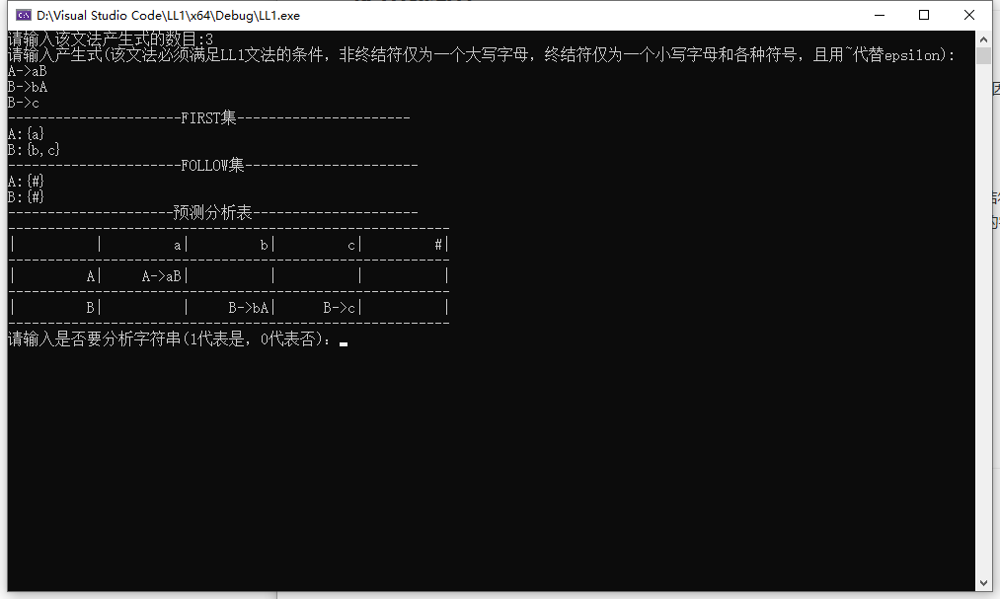
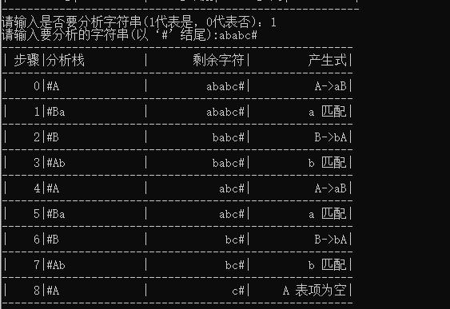
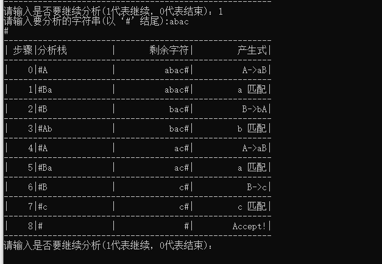
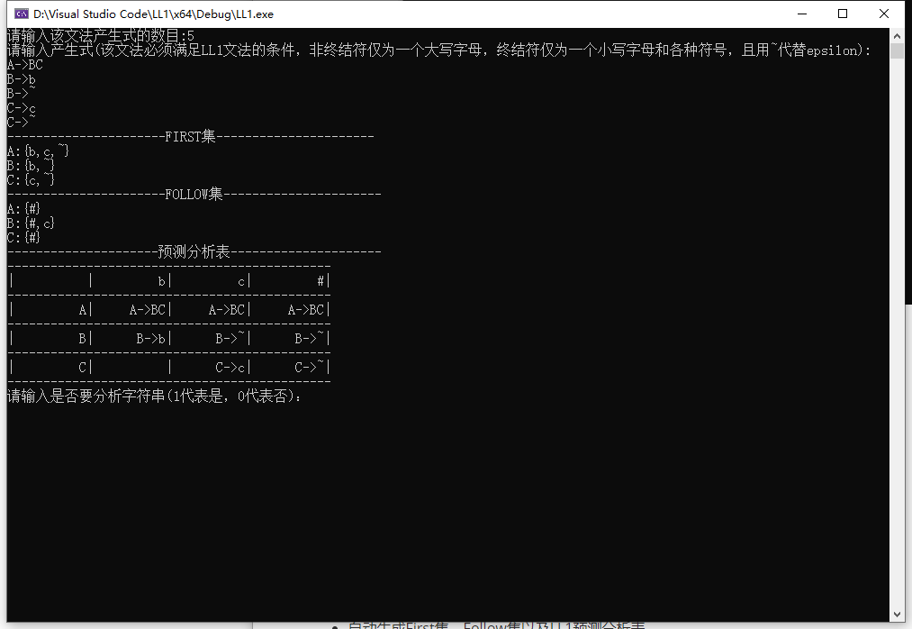
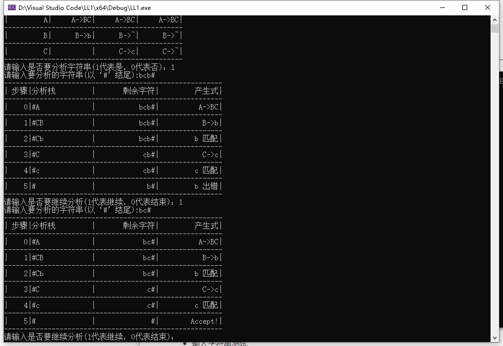

# 编译原理第四次上机作业：LL1递归下降语法分析程序

### 学号姓名：19200120陈国栋

## 使用说明：

### 输入：

1. 先输入文法的产生式个数，然后输入产生式，该文法必须为LL1文法（消除左递归和左公因子）

2. 输入1或0，选择是否要进行语法分析

3. 然后再输入要分析的字符串，该字符串需要以‘#’结尾

   输入的文法默认第一个输入的产生式的左部为起始符，非终结符仅为一个大写字母，终结符仅为一个小写字母和各种符号，且用~代替 epsilon,且输入的文法必须满足LL1文法的条件。输入的要分析的字符串需要以‘#’ 结尾

### 输出：

1. 输出该文法的first集和follow集
2. 输出该文法的LL1预测分析表
3. 输出用户输入的待分析字符串的分析过程

## 测试样例以及实验结果

### 测试样例1：

- 输入文法个数：3

- 文法：
  A->aB
  B->bA
  B->c

- 自动生成First集，Follow集以及LL1预测分析表

- 随意输入字符串（注意以#结尾）

字符串ababc匹配失败。

字符串abac匹配成功

### 测试样例2：

- 输入文法个数：5

- 文法：（~为空，也就是epsilon）

  A->BC
  B->b
  B->~
  C->c
  C->~

- 自动生成First集，Follow集以及LL1预测分析表

- 输入字符串测试

bc匹配成功，bcb错误

### 测试样例3

可自行测试，仅供参考

10
E->TA
A->+TA
A->-TA
A->~
T->FB
B->*FB
B->/FB
B->~
F->(E)
F->i
1
i+i*